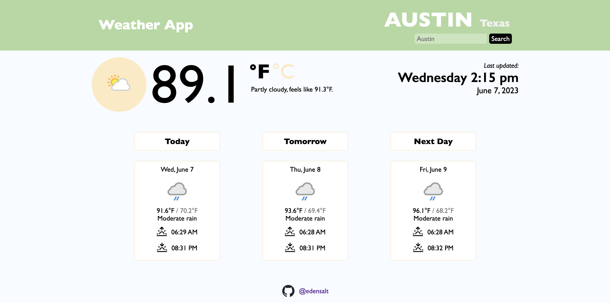
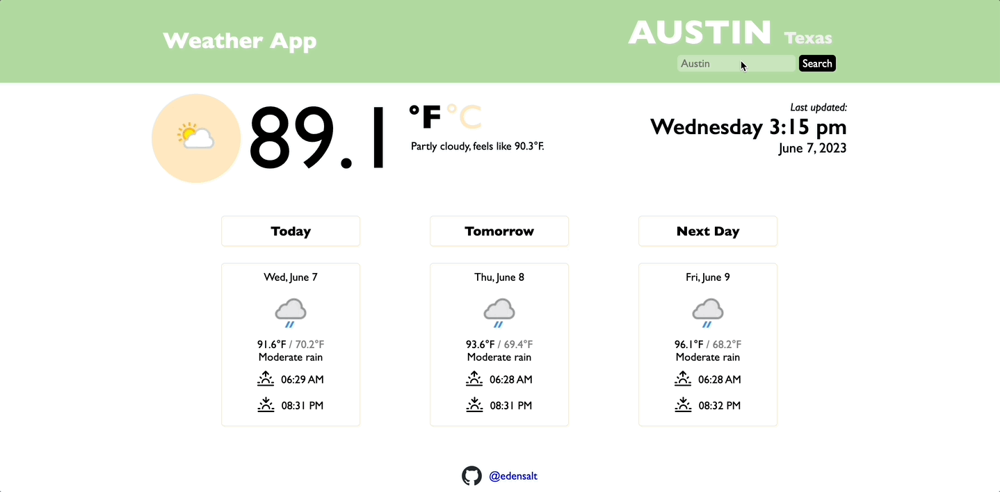
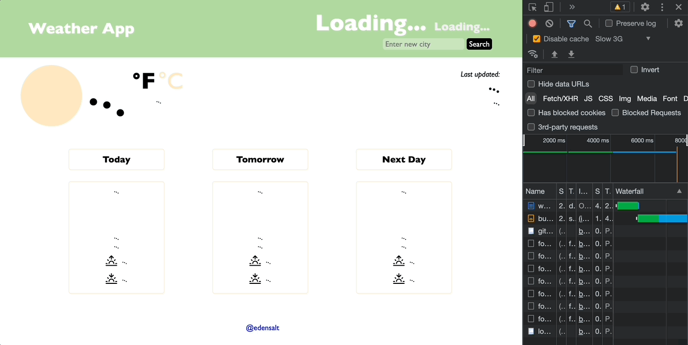
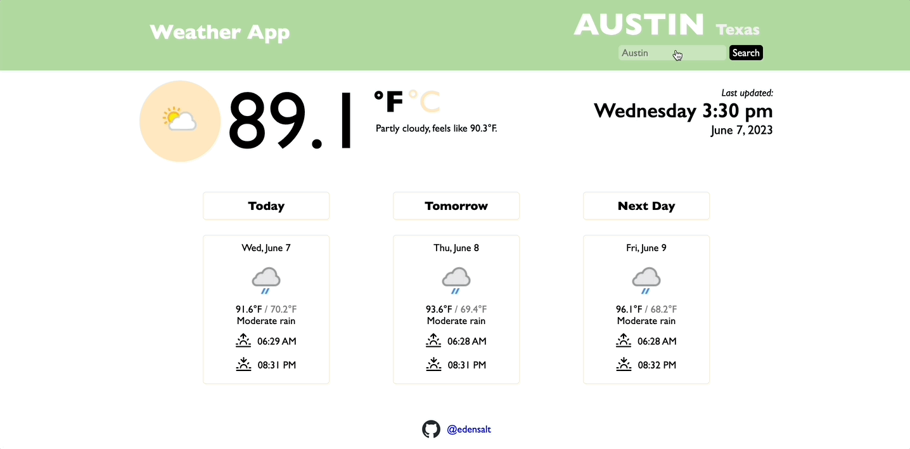
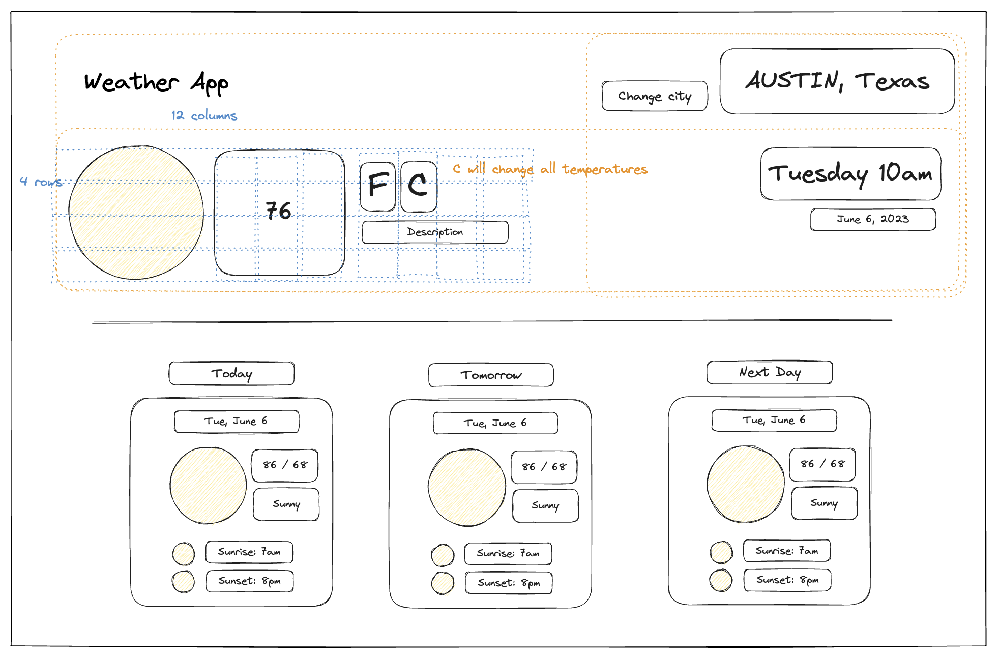

# weather-app

Weather app for the <a href="https://www.theodinproject.com/lessons/node-path-javascript-weather-app">Odin Project: JavaScript course</a>

## Skills demonstrated

- API requests
- JS promises (async/await, .then/.catch, try/catch)
- Sass for styling (media queries and calc()), CSS loading animations (keyframes)
- date-fns for date formatting
- JS ES6 Modules, imports and exports
- DOM manipulation
- Webpack, JSON and NPM

## Features

- Display the local time, current weather, and 3-day forecast from any city by typing the city name into the search bar.

- Alternate between fahrenheit and celsius.

- Ghost loaders while fetching data

- Receive an error if the city entered does not exist.

- Consistent app display for x-large screens
  - <i>Note: app not yet responsive for mobile</i>

## Design

The design of this weather app was based on Google's weather display when searching for local weather.

